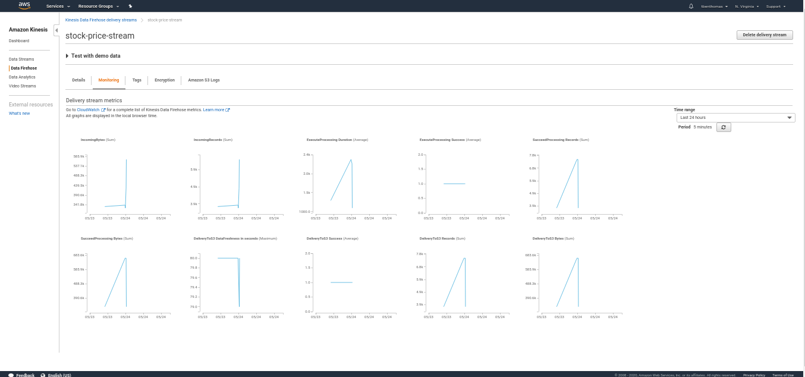

# Finance Data Streamer

This repo contains source code and data taken from a serverless process utilizing AWS Lambda, Kinesis Firehose, S3, Glue, and AWS Athena. The proess began with using a lambda function (see data_collector.py for source) to finance data from Yahoo Finance process it and PUT into a Kinesis Firehose Stream. The stream has a lambda function that will transform it into a necessary format and streams records in an S3 Bucket. A Glue crawler is pointed to the target bucket, which will create a table, which can then be queried using Athena.

An example Athena query is in the query.sql file, and the results of the query is results.csv. 
The data from yahoo finance for 10 stocks for May 14th, 2020, is in the finance_data folder. 

The Analysis.ipynb file contains some visuals based on the results.csv

## API Gateway URL for data collector lambda
https://5ldvpwcbql.execute-api.us-east-1.amazonaws.com/default/data_collector

## Lambda Configuration and Kinesis Monitoring Screen

### Data Collector Lambda Configuration

### Kinesis Monitoring Screen

